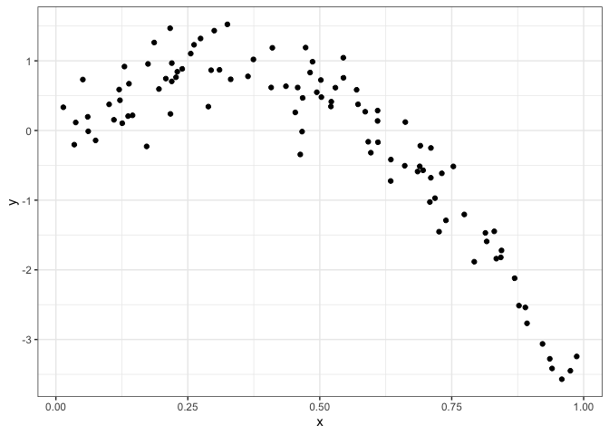
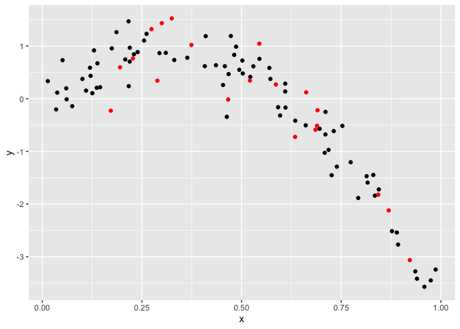
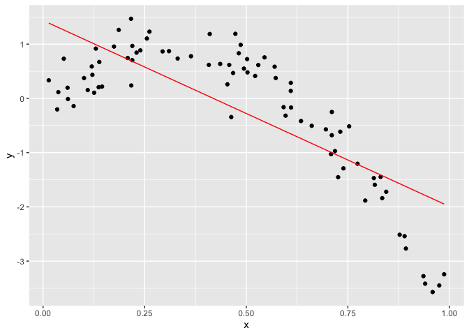
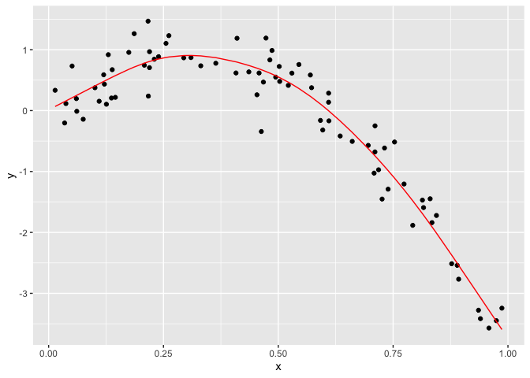
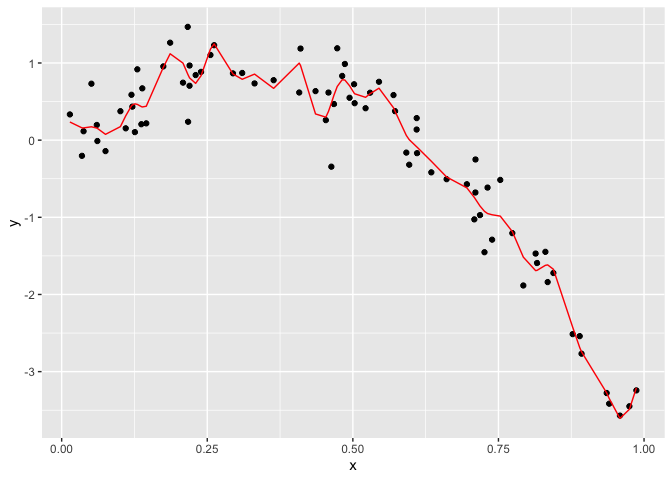
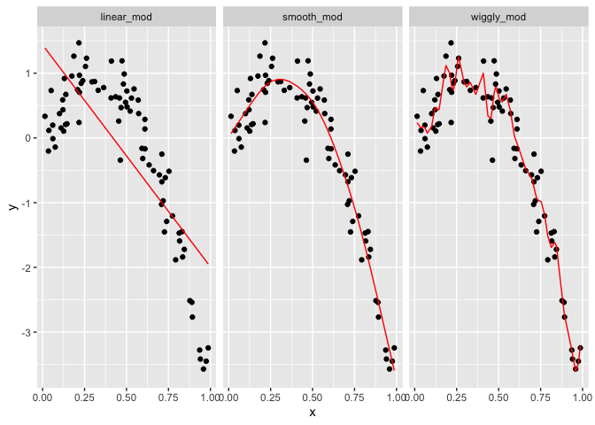

cross\_validation
================
Chuyue Xiang
11/12/2019

## Cross validation

Gnerate a dataset

``` r
nonlin_df = 
  tibble(
    id = 1:100,
    x = runif(100, 0, 1),
    y = 1 - 10 * (x - .3) ^ 2 + rnorm(100, 0, .3)
  )

nonlin_df %>% 
  ggplot(aes(x = x, y = y)) + 
  geom_point() + theme_bw()
```

<!-- -->

Training and testing

``` r
training_df = sample_frac(nonlin_df, size  = .8 )
test_df = anti_join(nonlin_df, training_df, by = "id")

ggplot(training_df, aes(x = x, y = y)) + 
  geom_point() + 
  geom_point(data = test_df, color = "red")
```

<!-- -->

Fit three models of varying goodness.

``` r
linear_mod = lm(y~x, data = training_df)
smooth_mod = mgcv::gam(y~s(x), data = training_df)
wiggly_mod = mgcv::gam(y ~ s(x, k = 30), sp = 10e-6, data = training_df)
```

Let’s look at some fits.

``` r
training_df %>% 
  add_predictions(linear_mod) %>% 
  ggplot(aes(x = x, y= y))+
  geom_point() + 
  geom_line(aes(y = pred), color = "red")
```

<!-- -->

``` r
training_df %>% 
  add_predictions(smooth_mod) %>% 
  ggplot(aes(x = x, y= y))+
  geom_point() + 
  geom_line(aes(y = pred), color = "red")
```

<!-- -->

``` r
training_df %>% 
  add_predictions(wiggly_mod) %>% 
  ggplot(aes(x = x, y= y))+
  geom_point() + 
  geom_line(aes(y = pred), color = "red")
```

<!-- -->

``` r
training_df %>% 
  gather_predictions(linear_mod, smooth_mod, wiggly_mod) %>% 
  mutate(model = fct_inorder(model)) %>% 
  ggplot(aes(x = x, y = y)) + 
  geom_point() + 
  geom_line(aes(y = pred), color = "red") + 
  facet_wrap(~model)
```

<!-- -->

``` r
rmse(linear_mod, test_df)
```

    ## [1] 0.7899144

``` r
## [1] 0.7052956
rmse(smooth_mod, test_df)
```

    ## [1] 0.433152

``` r
## [1] 0.2221774
rmse(wiggly_mod, test_df)
```

    ## [1] 0.4531097

``` r
## [1] 0.289051
```
